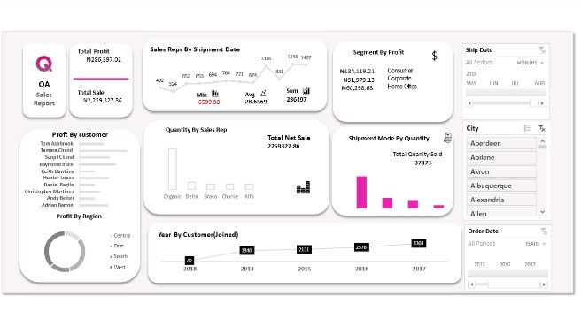

# **Sales Analysis and Performance Improvement**

***
## **Tool Used**
1. Microsoft Excel

***
## **Introduction**
In the realm of modern business, data-driven decision-making is pivotal for success. This project, *"Sales Analysis and Performance Improvement,"* utilizes Microsoft Excel to dissect a year's sales data. By employing Excel's analytical capabilities, we aim to uncover actionable insights that can drive strategic improvements in the sales landscape.

The dataset is a treasure trove of information encompassing products, customers, and sales representatives. Through data cleansing and analysis, we will unveil sales trends, explore customer behavior, and assess product and sales representative performance.

The ensuing visualizations and analyses will provide a clear roadmap for enhancing overall sales efficiency. From identifying high-value customers to optimizing product offerings, the goal is to distill complex data into practical recommendations that guide the company toward improved sales performance. This project serves as a bridge from raw data to strategic intelligence, empowering decision-makers with the tools they need to propel the company forward.

***
## **Data Cleaning**

- I Remove duplicate Values.
- Checked for missing values and decide on appropriate handling strategies (imputation, removal, etc.).
- Standardize and clean data formats (e.g., date formats, currency symbols).

***
## Analysis Questions:

After conducting a thorough analysis of the sales data, several key insights have emerged, shedding light on various aspects of the business's performance.

1. **Total Profit and Sales Over Time**
The analysis reveals a clear trajectory of both total profit and sales over the specified period. Understanding the patterns and identifying peaks and troughs can assist in strategic planning.

2. **Top 10 Customers by Profit**
The top 10 customers by profit have been identified, highlighting the significance of cultivating and maintaining strong relationships with these high-value clients. Special attention to their preferences and needs could further enhance customer satisfaction and loyalty.

3. **Regional Contribution to Profit**
A comprehensive understanding of regional contributions to profit showcases opportunities for targeted marketing or expansion strategies. Focusing efforts on regions with higher profit potential could yield substantial returns.

4. **Customer Onboard Trends**
The analysis of customer onboarding trends over the years provides insights into the effectiveness of acquisition strategies. Recognizing patterns can aid in refining marketing and onboarding approaches for sustained growth.

5. **Profitable Product Segments**
Identification of the most profitable product segments offers a roadmap for continued success. Simultaneously, recognizing areas with potential for improvement in purchase volume can guide product development or marketing efforts.

6. **Sales Representative Performance**
Evaluating sales representatives' performance in terms of quantity sold provides a nuanced understanding of individual contributions. Recognizing top performers and offering support or training to those with lower quantities can optimize the team's overall efficacy.

7. **Preferred Shipment Modes**
Determining the most frequently used shipment mode by sales representatives unveils operational preferences. Streamlining processes related to the preferred mode can enhance efficiency and reduce costs.

***
## **Data Visualization**

***
## **Recommendations**

1. **Optimize Marketing and Sales Strategies**
Tailor marketing efforts to capitalize on profitable product segments and high-value customers. Develop targeted campaigns to attract similar clientele.

2 **Enhance Customer Relationship Management**
Foster relationships with the top 10 customers by profit through personalized communication and exclusive offers. Aim for customer loyalty and repeat business.

3. **Regional Expansion**
Consider expanding operations or intensifying marketing efforts in regions contributing significantly to profit. Explore opportunities for growth and market penetration.

4. **Refine Onboarding Processes**
Analyze the trends in customer onboarding and adjust strategies to attract and retain customers more effectively. Continuously optimize the onboarding experience based on historical data.

5. **Sales Team Training and Recognition**
Recognize and reward high-performing sales representatives to boost morale. Provide additional training and support to those with lower quantities to enhance their performance.

6. **Operational Efficiency**
Evaluate the efficiency of different shipment modes. If a particular mode is more cost-effective, consider negotiating better terms with suppliers or focusing on optimizing logistics.

By implementing these recommendations, the business can build on its strengths, address weaknesses, and position itself for sustained growth and profitability. Regular monitoring and adaptation of strategies based on ongoing analysis will be crucial for long-term success.

***
Thank you for taking the time to explore this project. Your interest and attention are genuinely appreciated. If you have any contributions or suggestions, I welcome the opportunity to connect and discuss any ideas you may have. Feel free to reach out to me on [Twitter](https://twitter.com/techie1002) or connect with me on [LinkedIn](https://www.linkedin.com/in/prince-chukwuemek-b33692203/). I would love to engage in a conversation and hear your thoughts. Looking forward to connecting!

